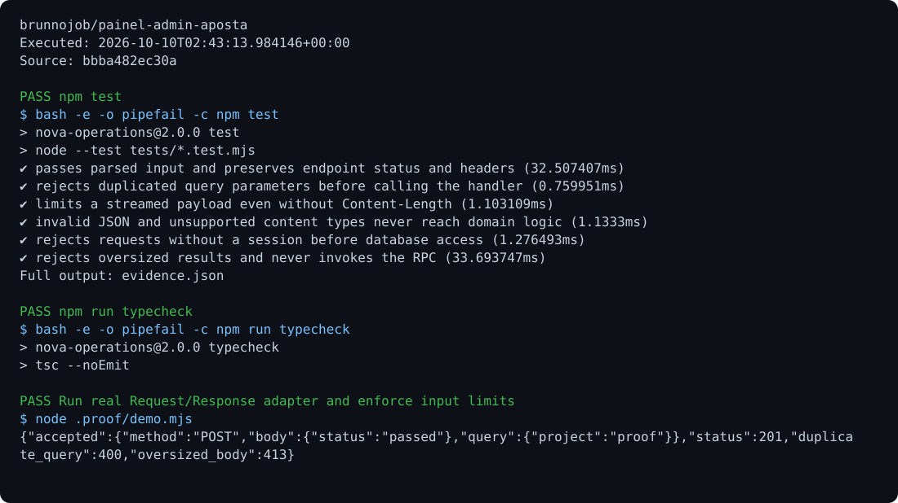

# NOVA Operations

An authenticated operations dashboard with work orders, priorities, state transitions, recent telemetry, filters, and export.

## Run

Requirements: JavaScript, TypeScript, Vercel Functions, and Supabase.

```sh
npm ci
npm test
npm run typecheck
npm run dev
```

## Behavior

Set `SUPABASE_URL` and `SUPABASE_PUBLISHABLE_KEY`. Users create an account and confirm their email when required. Work orders follow open → acknowledged → closed. RLS policies isolate records by user; the operations archive uses the same account.

## Optional report archive

Use the [shared operations archive client](https://github.com/brunnojob/vercel-home-telemetry-api/tree/main/cloud) to queue `result.json` under project `painel-admin-aposta`. The client uses `BRUNNODEV_ACCESS_TOKEN` and retains unacknowledged reports locally.

## License

Original source and documentation are MIT licensed; see [LICENSE](LICENSE). Third-party dependencies and media retain their respective terms. Maintained by [Brunno Dev](https://brunnodev.store).

## Implementation update

The Netlify build publishes the web interface and compatible API functions. The request adapter bounds JSON payloads, rejects ambiguous query strings and preserves handler statuses. Confirmed run receipts include the submitted client key. Configure Supabase URL and publishable key as runtime environment variables.

Contribution trailer: `Co-authored-by: nyctophile <33561761+ineedfoundmyway@users.noreply.github.com>`.

## Execution proof

[](https://github.com/brunnojob/painel-admin-aposta/actions/workflows/proof.yml)



[Verified run](https://github.com/brunnojob/painel-admin-aposta/actions/runs/38017981108) · [Execution report](docs/proof/evidence.json)

Run `python .proof/record.py` after installing the prerequisites above. The scenarios execute repository code and verify exit codes and expected output. CI publishes `execution-proof` with the transcript, input fingerprints and source commit. The downloadable report identifies the exact tested version; the workflow badge tracks the latest run.
